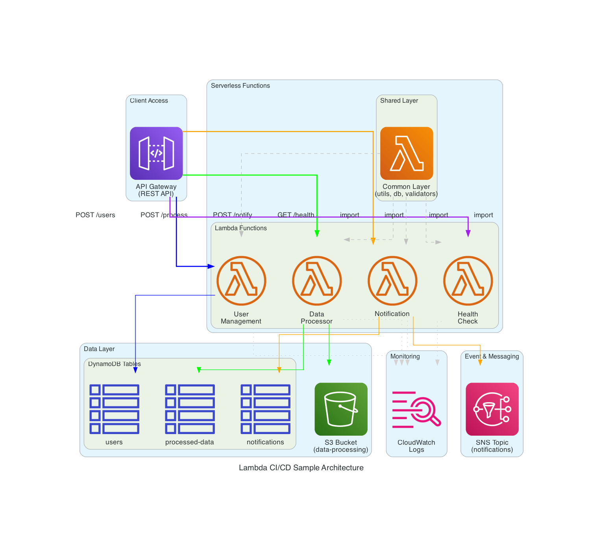
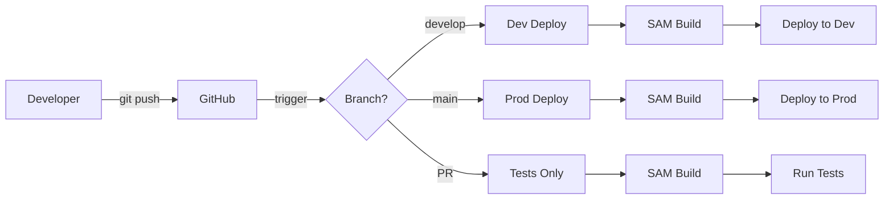

# Lambda CI/CD Sample

[](https://aws.amazon.com/)
[](https://aws.amazon.com/lambda/)
[](https://python.org/)
[](https://aws.amazon.com/serverless/sam/)
[](https://github.com/features/actions)

複数のLambda関数を含む、サーバーレスアプリケーションのサンプルプロジェクトです。GitHub ActionsによるCI/CDパイプライン、共通レイヤー、CloudWatchモニタリングを含む実践的な構成を提供します。

## 目次

- [システム構成](#システム構成)
- [機能概要](#機能概要)
- [前提条件](#前提条件)
- [セットアップ](#セットアップ)
- [デプロイ](#デプロイ)
- [テスト](#テスト)
- [CI/CDパイプライン](#cicdパイプライン)
- [トラブルシューティング](#トラブルシューティング)

## システム構成

本プロジェクトは、API Gateway、Lambda関数、DynamoDB、S3、SNSを組み合わせたサーバーレスアーキテクチャを採用しています。

### アーキテクチャ図



### アーキテクチャ概要

上記の構成図は、以下のコンポーネントで構成されています：

#### フロントエンド層
- **API Gateway**: すべてのHTTPリクエストのエントリポイント
  - 各Lambda関数への適切なルーティング
  - リクエストの検証とレート制限

#### コンピューティング層
- **Lambda関数**: 4つのサーバーレス関数
  - User Management (ユーザー管理)
  - Data Processor (データ処理)
  - Notification (通知)
  - Health Check (ヘルスチェック)
- **共通レイヤー**: 全Lambda関数で共有されるコードとライブラリ
  - 共通ユーティリティ、データベース操作、バリデーション機能

#### データ層
- **DynamoDB**: NoSQLデータベース
  - `users` テーブル: ユーザー情報
  - `processed-data` テーブル: 処理済みデータ
  - `notifications` テーブル: 通知履歴
- **S3**: オブジェクトストレージ
  - データファイルの保存
  - イベントトリガーによる自動処理

#### メッセージング層
- **SNS**: 通知配信のためのメッセージングサービス
  - 非同期通知処理
  - 複数の配信先への通知

#### 監視・ログ層
- **CloudWatch**: ログとメトリクスの収集
  - 全Lambda関数の実行ログ
  - パフォーマンスメトリクス

### プロジェクト構成

```
lambda-cicd-sample/
├── template.yaml              # SAMテンプレート
├── src/
│   ├── user_management/      # ユーザー管理Lambda関数
│   │   └── user_management.py
│   ├── data_processor/       # データ処理Lambda関数
│   │   └── data_processor.py
│   ├── notification/         # 通知Lambda関数
│   │   └── notification.py
│   ├── health_check/         # ヘルスチェックLambda関数
│   │   └── health_check.py
│   ├── layers/               # 共通レイヤー
│   │   └── common/
│   │       ├── python/       # レイヤーのPythonコード
│   │       │   ├── db.py
│   │       │   ├── utils.py
│   │       │   ├── validators.py
│   │       │   └── requirements.txt
│   │       └── requirements.txt
│   └── tests/                # テストコード
│       └── test_user_management.py
├── events/                   # テスト用イベントファイル
│   ├── user-create.json
│   ├── user-get.json
│   ├── s3-event.json
│   └── notification-send.json
├── .github/workflows/        # GitHub Actions
│   └── cicd.yml
└── README.md
```

## 機能概要

### Lambda関数

1. **User Management** - ユーザー管理API
   - POST /users - ユーザー作成
   - GET /users/{id} - ユーザー取得
   - GET /users - ユーザー一覧

2. **Data Processor** - データ処理
   - POST /process - API経由でのデータ処理
   - S3イベントトリガー - アップロードファイルの自動処理

3. **Notification** - 通知サービス
   - POST /notify - Email/SMS通知の送信
   - SNSトピック経由の通知処理

### 共通レイヤー

すべてのLambda関数で共有される共通コンポーネント：

#### レイヤー構造
```
src/layers/common/
├── python/                    # Python実行時にインポートされるディレクトリ
│   ├── db.py                 # DynamoDB操作クラス
│   ├── utils.py              # 共通ユーティリティ関数
│   ├── validators.py         # 入力検証関数
│   └── requirements.txt      # レイヤー固有の依存関係
└── requirements.txt          # レイヤービルド用の依存関係
```

#### 各モジュールの役割

**`db.py`**
- DynamoDBテーブル操作の基底クラス
- CRUD操作の共通メソッド
- 環境変数ベースのテーブル名管理

**`utils.py`**
- HTTPレスポンス生成
- JSON解析とエラーハンドリング
- ログ出力の標準化
- 共通の設定管理

**`validators.py`**
- 入力データの検証
- 型チェックと必須フィールド検証
- エラーメッセージの標準化

#### レイヤーの利用方法

Lambda関数内でレイヤーのモジュールをインポート：
```python
from utils import create_response, get_logger
from db import DynamoDBBase
from validators import validate_user_input
```

## 前提条件

- [AWS CLI](https://aws.amazon.com/cli/) - インストール済みで設定済み
- [AWS SAM CLI](https://docs.aws.amazon.com/serverless-application-model/latest/developerguide/serverless-sam-cli-install.html)
- [Docker](https://www.docker.com/) - SAM Localでのテスト用
- Python 3.9以上

## セットアップ

### 1. 依存関係のインストール

```bash
# Python仮想環境を作成
python3 -m venv venv

# 仮想環境を有効化
source venv/bin/activate  # macOS/Linux
# venv\Scripts\activate   # Windows

# 必要なパッケージをインストール
pip install --upgrade pip
pip install pytest "moto[dynamodb]" boto3
pip install -r src/layers/common/requirements.txt
```

### 2. SAMビルド

```bash
sam build
```

## デプロイ

### 手動デプロイ

開発環境へのデプロイ：
```bash
sam deploy \
  --stack-name lambda-cicd-dev \
  --parameter-overrides Environment=dev LogLevel=DEBUG \
  --capabilities CAPABILITY_IAM \
  --region ap-northeast-1 \
  --resolve-s3
```

本番環境へのデプロイ：
```bash
sam deploy \
  --stack-name lambda-cicd-prod \
  --parameter-overrides Environment=prod LogLevel=INFO \
  --capabilities CAPABILITY_IAM \
  --region ap-northeast-1 \
  --resolve-s3
```

### GitHub Actionsによる自動デプロイ

1. GitHubリポジトリの設定
   - Settings → Environments で以下を作成:
     - `test`
     - `development`
     - `production`

2. AWS OIDC認証の設定
   - IAMロールの作成とGitHub Secretsの設定
   - 詳細は [docs/aws-oidc-setup.md](docs/aws-oidc-setup.md) を参照

3. デプロイフロー
   - `develop` ブランチ → 開発環境へ自動デプロイ
   - `main` ブランチ → 本番環境へ自動デプロイ
   - プルリクエスト → テスト実行

## テスト

### ローカルテスト

単体テストの実行：
```bash
# 仮想環境を有効化
source venv/bin/activate

# テストを実行
cd src/tests
python -m pytest test_user_management.py -v
```

SAM Localによる関数テスト：
```bash
# ユーザー管理関数のテスト
sam local invoke UserManagementFunction --event events/user-create.json

# データ処理関数のテスト
sam local invoke DataProcessorFunction --event events/s3-event.json

# 通知関数のテスト
sam local invoke NotificationFunction --event events/notification-send.json
```

ローカルAPIサーバーの起動：
```bash
# APIサーバーを起動
sam local start-api --port 3000

# 別ターミナルでテスト
curl -X POST http://localhost:3000/users \
  -H "Content-Type: application/json" \
  -d '{"name": "Test User", "email": "test@example.com"}'
```

### 統合テスト

デプロイ後のAPIテスト：
```bash
# API URLを取得
API_URL=$(aws cloudformation describe-stacks \
  --stack-name lambda-cicd-dev \
  --query 'Stacks[0].Outputs[?OutputKey==`ApiGatewayUrl`].OutputValue' \
  --output text)

# APIテスト
curl -X POST $API_URL/users \
  -H "Content-Type: application/json" \
  -d '{"name": "Test User", "email": "test@example.com"}'
```

## CI/CDパイプライン

GitHub Actionsを使用した自動化されたCI/CDパイプラインの構成：



### ワークフローのステップ

1. **ビルド** - SAMによるアプリケーションのビルド
2. **テスト** - 単体テストの実行
3. **デプロイ** - 環境に応じたデプロイ
4. **検証** - デプロイ後の動作確認


## セキュリティ

- IAMロールは最小権限の原則に基づいて設定
- 環境変数で機密情報を管理
- VPCとWAFの設定は必要に応じて実装